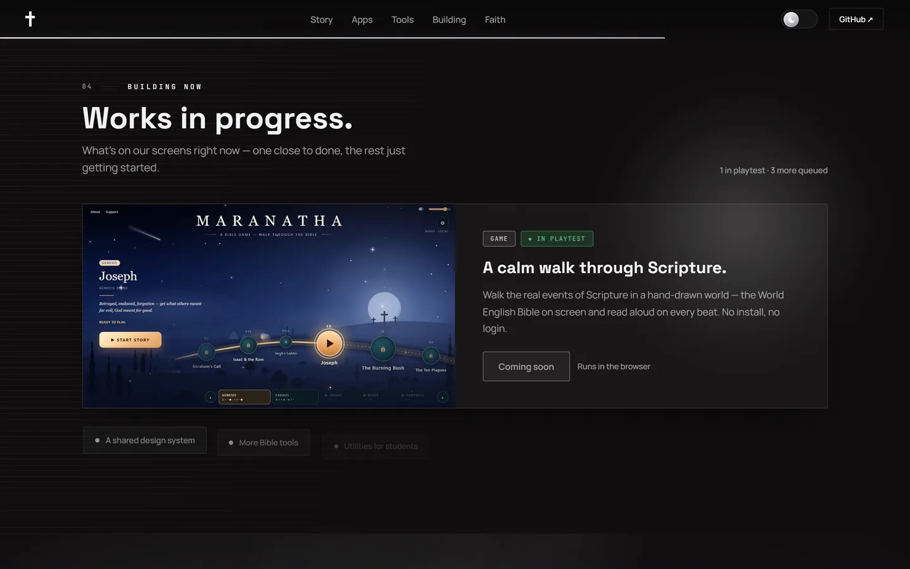

# ✝️ TDG · The Disciples of God

**Brothers building software, games, and tools for the glory of Jesus.**

Two brothers, Nate & Luke. This is our landing page.

### 🌐 [**tdg-org.github.io/TDG-Site**](https://tdg-org.github.io/TDG-Site/)

 

---

## 📸 A look around

|  |  |
|:--|:--|
|  **Our story** · five chapters on a timeline that fills as you read |  **Apps** · cards that tilt toward your cursor and light their edge nearest it |
|  **Building now** · what's on our screens right now |  **Faith** · a slow gradient field and one verse |

**🌗 One toggle, two worlds.** Colour crosses the page as a wave, not a snap.

| Dark | Light |
|:--:|:--:|
|  |  |

**📱 Built down to 320px.**

---

## 🛠️ What we're building

### 💻 Apps

| # | Project | What it does | Status |
|:--|:--|:--|:--|
| 01 | **Bible Educator** | Read, listen, study and take rich notes on Scripture. 16 translations, fully offline. | 🟡 In dev |
| 02 | **Say2Quill** | Press one key, speak, and clean text lands wherever your cursor is. On-device. | 🟡 In dev |
| 03 | **Makullveny** | A calm desk for studying: books, syllabus import, flashcards, nine themes. | 🟡 In dev |
| 04 | **DevFleet** | Every git repo on your machine as a live card, sixteen panes at once. | 🟡 In dev |
| 05 | **Music Everything** | Scales, chords, a playable piano, live pitch tracking, MIDI export. | 🟡 In dev |
| 06 | **TDG Veditor** | A desktop video editor: timeline, effects, colour, audio, FFmpeg export. | 🟡 In dev |

### 🧩 Tools & extensions

| # | Project | What it does | Status |
|:--|:--|:--|:--|
| 07 | **[Volume Controller](https://chromewebstore.google.com/detail/volume-controller/lamahdjkmgpfpcoccinmipdonifnadcf)** | Global & per-site volume 0–600%, with EQ and loudness normalize. | 🟢 **Live on the Chrome Web Store** |
| 08 | **VidHelper** | A local video downloader: an extension plus a small backend on `127.0.0.1`. | 🟠 WIP |
| 09 | **N8-Tools** | A browser workspace for music and sound: transcripts, melody → MIDI, tuner. | 🟠 WIP |

### 🎮 Games

| Project | What it does | Status |
|:--|:--|:--|
| **MARANATHA** | Walk the real events of Scripture in a hand-drawn world. The World English Bible on screen and read aloud on every beat. No install, no login. | 🔵 In playtest |

> Most of what we build sits in private repos until it is ready, but you can watch
> what's public at **[github.com/TDG-Org](https://github.com/TDG-Org)**.

---

## 📄 License

**TDG Source-Available License.** Read it, run it, learn from it, fork it privately.
Just don't ship it as your own. See [LICENSE](LICENSE).

 

**JESUS IS KING**

© 2026 TDG · Built by brothers, Nate & Luke · <a href="https://natemci.com">natemci.com</a>

