<div align="center">

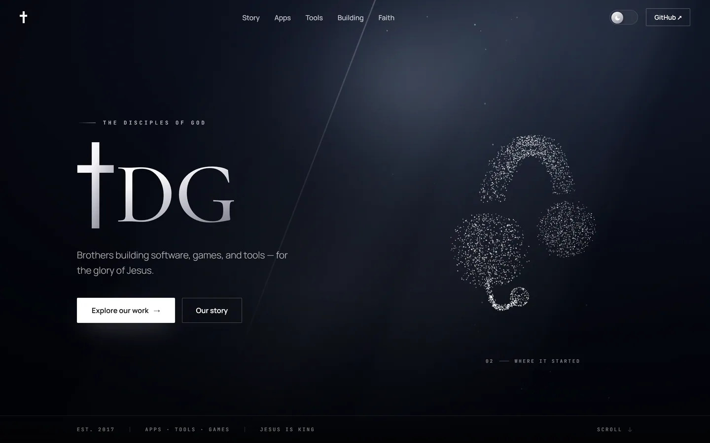

# ✝️ TDG · The Disciples of God

**Brothers building software, games, and tools for the glory of Jesus.**

Two brothers, Nate & Luke. **The site is called TDG Cebu** — that is the name on
a tab, a bookmark and a Home Screen tile, and the name every other app of ours
uses when it sends you here. The repo stays `TDG-Site`, and so does the address
below; a URL is not a name.

This is our landing page, our shop, and the front door to every account we run.

## 🌐 [**tdg-org.github.io/TDG-Site**](https://tdg-org.github.io/TDG-Site/)

<sub>Live now · eleven products, each with a page of its own · no analytics, no trackers, no cookie banner</sub>

<br>


</div>

---

## 📸 A look around

The home page runs 01 → 05 in one scroll, each chapter with a scene behind it that moves as you read.

|  |  |
|:--|:--|
| 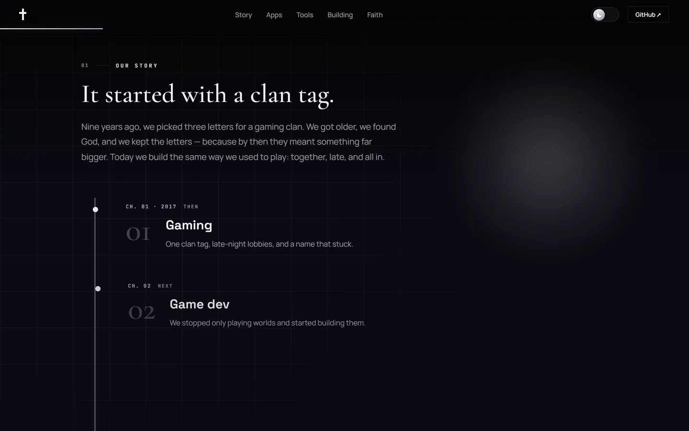 **01 · Our origin** — seven chapters on a timeline that fills as you walk past a cabin in the snow | 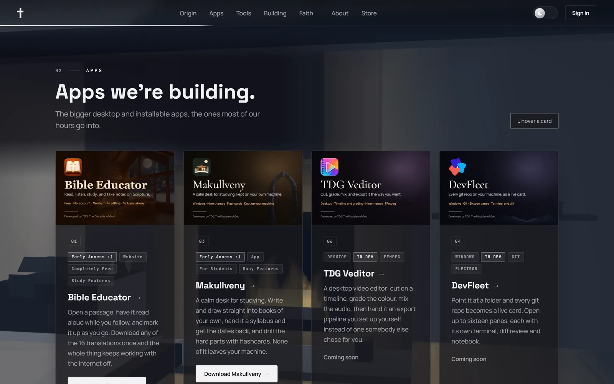 **02 · Apps** — cards that tilt toward your cursor and light the edge nearest it |
| 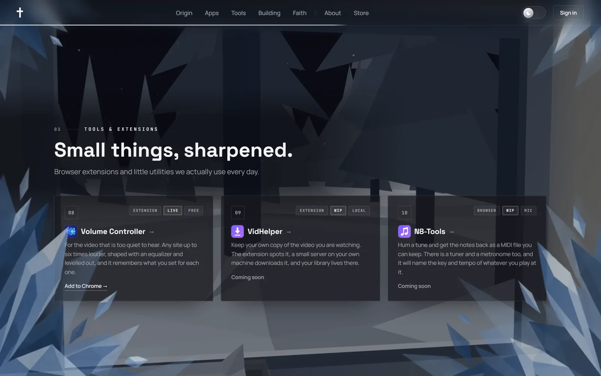 **03 · Tools & extensions** — the small things we actually use every day | 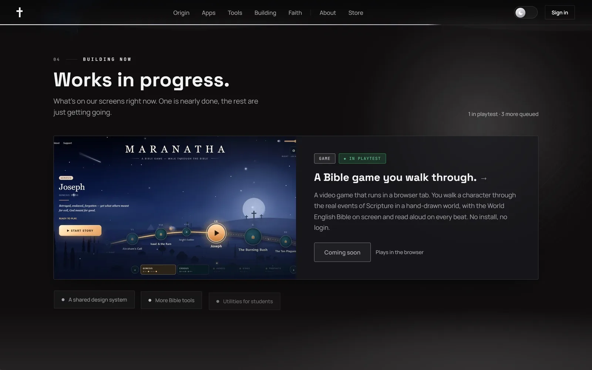 **04 · Games** — the one game in playtest, and the queue behind it |

<div align="center">

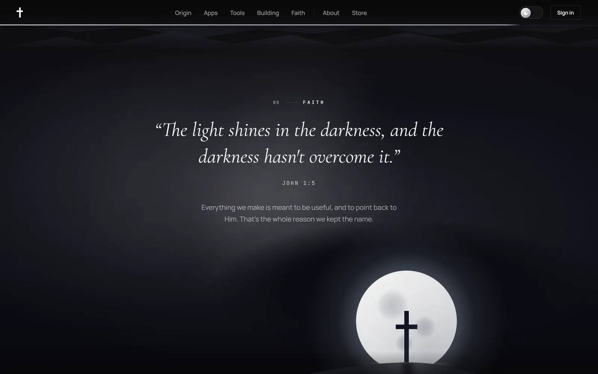

**05 · Faith** — one verse, a slow gradient field, and the reason the name stayed.

</div>

### 📄 Every card opens a page of its own

|  |  |
|:--|:--|
| 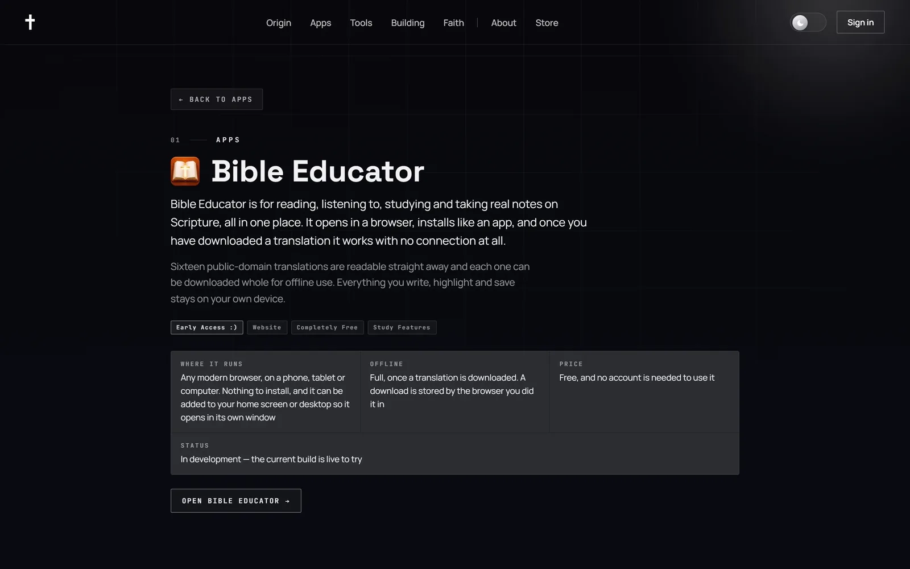 | 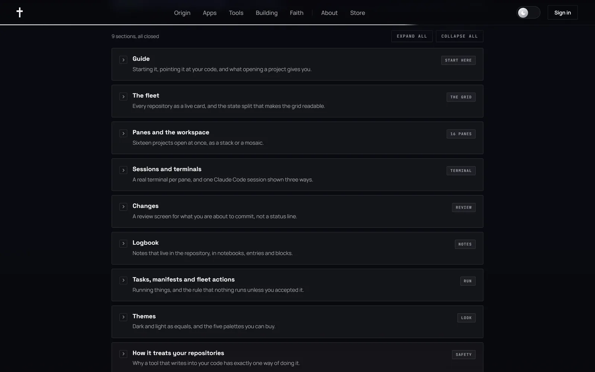 |
| **What it is, in two sentences** — then the strip that answers *can I run this*: what it runs on, what else you need, what it costs you, whether it is finished | **Shut, it reads as an index** — one row per part with a line saying what is inside, so nine sections are a table of contents rather than a wall |

Each of the eleven has a guide written for somebody who has **not** installed it yet, and
every feature explained rather than listed. Back returns you to the exact place in the list
you left. All of that copy lives in [`src/data/appPages.ts`](src/data/appPages.ts) — adding an
app is a content edit, never a component.

**🧭 [About](src/data/about.ts) is the same page, for us rather than an app.** Who we are, why
we build what we build, and a Q&A that takes the awkward questions: what is free, who handles
the card details, what happens to your things if we stop. Every answer is checkable against
something in this repo, and where we do not have one yet it says so.

<div align="center">
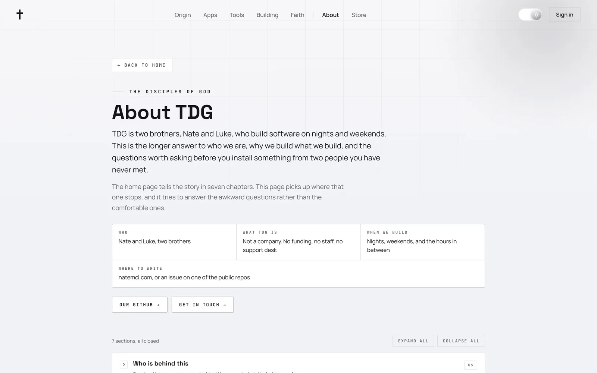
</div>

### 🛒 The Store, and what an account owns

|  |  |
|:--|:--|
| 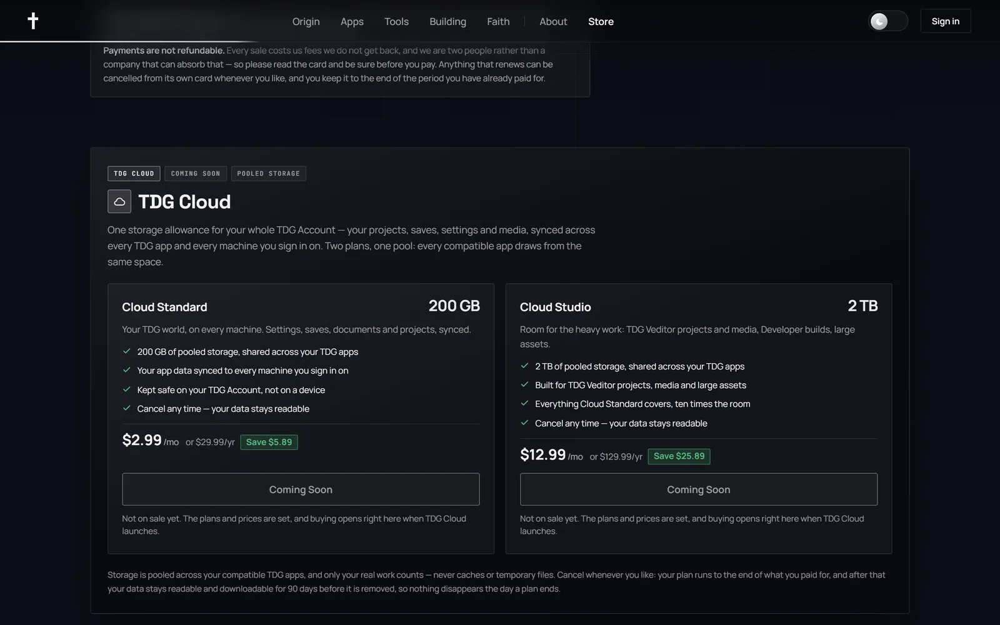 | 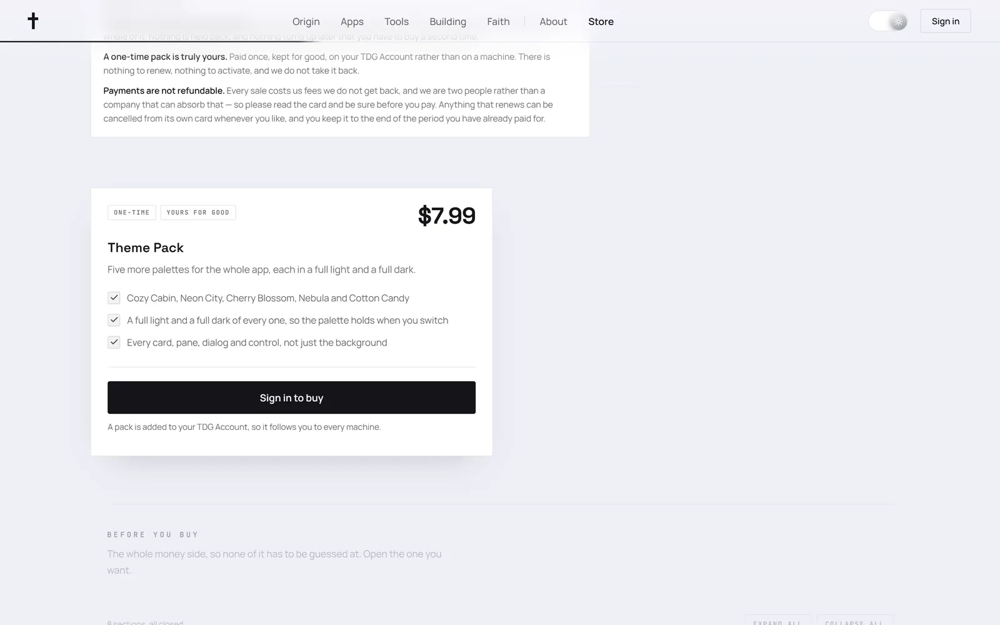 |
| **It follows your account, not your machine** — a few paid extras for the apps we build, and the plan shelf for **TDG Cloud**, one pooled storage allowance across every TDG app | **One app, its packs, its prices** — bought once, kept for good, and it lands on your TDG Account rather than on a device |

Prices are not written in this README on purpose. A price lives in exactly one place per
surface and has to match Stripe and the app that also sells it — [rule 10](AGENTS.md) has the
whole chain, and a number pasted into a readme is the copy nobody remembers to change.

TDG Cloud is **built and dormant**: every state has a face, the plans are priced from the
server, and what makes it *Coming Soon* is one flag in `tdg_cloud_config` — launch day is a
developer flipping it, not a deploy. See [`src/cloud/`](src/cloud/README.md).

### 👤 One account, four apps, and the console behind them

<div align="center">
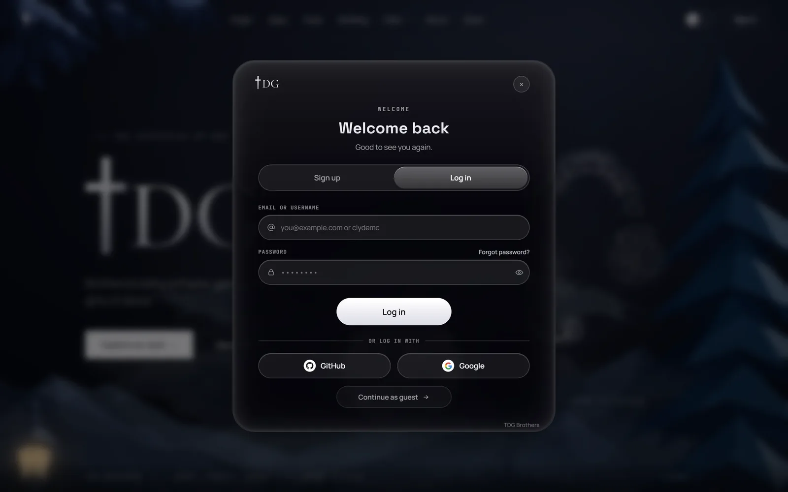
</div>

Sign in with a **username or an email**, with GitHub and Google beside it, or carry on as a
guest — the site never gates a page it can simply explain. The account it signs you into is
the same **TDG Core** account Bible Educator, Makullveny, TDG Veditor and DevFleet use, so a
pack bought here unlocks there.

| | |
|:--|:--|
| [`src/auth/`](src/auth/README.md) · signing in, the profile, session revocation, and what a refusal is allowed to say | [`src/account/`](src/account/README.md) · `#/account`: what the account is, what it counts, and who may see each part |
| [`src/people/`](src/people/README.md) · `#/user/<handle>`: somebody else's account, and what a block looks like said out loud | [`src/badges/`](src/badges/README.md) · the marks on an account, and the account count in the footer |
| [`src/feedback/`](src/feedback/README.md) · Send Feedback, and the panel that delivers our replies | [`src/notices/`](src/notices/README.md) · messages about what an account owns, waiting for the person they are about |
| [`src/store/`](src/store/README.md) · which packs an account owns, and which products it may not | [`src/dev/`](src/dev/README.md) · the Developer console at `#/dev`, for a signed-in TDG developer only |

### 🌗 One toggle, two worlds

Colour crosses the page as a wave, not a snap — every themed element gets its own delay,
measured from the toggle you pressed.

<div align="center">

| Dark | Light |
|:--:|:--:|
|  | 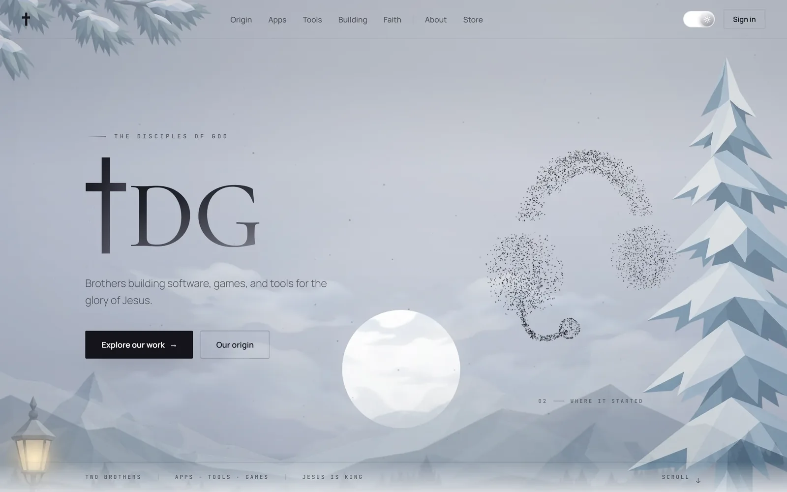 |

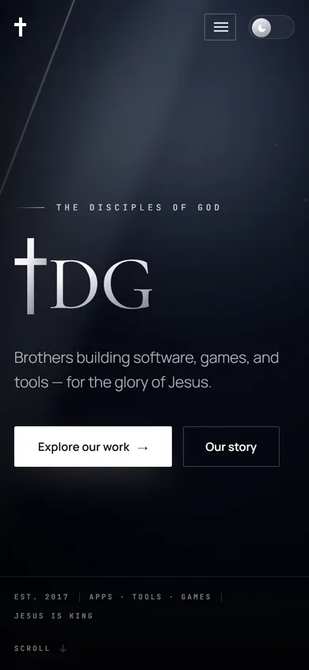

**📱 Built down to 320px, and up to 300% zoom.**

</div>

---

## 🛠️ What we're building

Statuses here are what we say. The site itself asks GitHub at runtime and **upgrades** them —
a card's caption becomes a real button the moment a deploy answers, and says
*Temporarily unavailable* if one that used to answer stops. See [`src/live/`](src/live/README.md).

### 💻 Apps

| # | Project | What it does | Status |
|:--|:--|:--|:--|
| 01 | **Bible Educator** | Read, listen, study and take real notes on Scripture. 16 translations, notes you can draw in, no account. | 🟢 Live to try |
| 02 | **Say2Quill** | Press one key, speak, and clean punctuated text lands wherever your cursor is. On-device. | 🟡 In dev |
| 03 | **Makullveny** | A calm desk for studying: your own books, a syllabus turned into dates, flashcards, nine themes. | 🟢 **Released** · [download](https://tdg-org.github.io/makullveny-site/#download) |
| 04 | **DevFleet** | Every git repo on your machine as a live card, up to sixteen panes at once. | 🟡 In dev |
| 05 | **Music Everything** | Scales, chords, a playable piano, live pitch tracking, MIDI export to your DAW. | 🟡 In dev |
| 06 | **TDG Veditor** | A desktop video editor: timeline, colour, audio, effects, FFmpeg export. | 🟡 In dev |
| 07 | **MVTrade** | A day-trading robot that learns from every trade. Paper money only — real money is locked in the code. | 🟡 In dev |

### 🧩 Tools & extensions

| # | Project | What it does | Status |
|:--|:--|:--|:--|
| 08 | **[Volume Controller](https://chromewebstore.google.com/detail/volume-controller/lamahdjkmgpfpcoccinmipdonifnadcf)** | Global and per-site volume 0–600%, with EQ, loudness levelling, delay and reverb. | 🟢 **On the Chrome Web Store** |
| 09 | **VidHelper** | Save the video you are watching: an extension plus a small server on `127.0.0.1`. | 🟠 WIP |
| 10 | **N8-Tools** | A browser workspace for music and sound: transcripts, hum → MIDI, tuner, key and BPM. | 🟠 WIP |

### 🎮 Games

| # | Project | What it does | Status |
|:--|:--|:--|:--|
| 11 | **[MARANATHA](https://tdg-org.github.io/MARANATHA/)** | Walk the real events of Scripture in a hand-drawn world, the World English Bible on screen and read aloud on every beat. No install, no login. | 🔵 **In playtest — playable now** |

> Most of what we build sits in private repos until it is ready. What is public is at
> **[github.com/TDG-Org](https://github.com/TDG-Org)**.

---

## 🧱 How it is built

| | |
| --- | --- |
| **Stack** | React 19 · TypeScript 5.9 · Vite 7 |
| **Styling** | Hand-written CSS. No framework, no CSS-in-JS, no component library. Every colour is a token with a light value and a dark one. |
| **Router** | Hash routes, hand-rolled in [`src/lib/route.ts`](src/lib/README.md). No router library. |
| **State** | React context and hooks. No Redux, Zustand, Jotai, or React Query. |
| **Backend** | Supabase — **TDG Core**, shared with the other TDG apps. Nine edge functions and the SQL live in [`supabase/`](supabase/README.md). |
| **Motion** | One frame loop, five hooks, and everything pauses off-screen. `prefers-reduced-motion` is honoured, not approximated. |
| **Hosting** | GitHub Pages from `main`, at `/TDG-Site/`. The deploy is **manual** (`workflow_dispatch`) — pushing does not publish. |
| **Tests** | There are none. The typecheck and the build are the entire safety net — which is why [`AGENTS.md` §7](AGENTS.md) defines what "done" means instead. |

**Every product's words are data.** The catalogue, the pages, About, the Store's prose and the
Origin chapters all live in [`src/data/`](src/data/README.md), and since 2.0.0 the Developer
console can override any of it at runtime through [`src/content/`](src/content/README.md) —
what the repo ships is the default and the fallback, never the last word.

### 🧭 Building on this

**Working on this repo — human or AI? Read [`AGENTS.md`](AGENTS.md) first.** It is the written
standard: the eighteen rules, the five jobs you will actually be asked to do, what is
deliberately not up for redesign, and what "done" means with no test suite. Then every
significant folder carries its own README, and that README is authoritative for its folder:

| | | |
|:--|:--|:--|
| [`src/`](src/README.md) · the shape of it | [`src/data/`](src/data/README.md) · the catalogue and its pages | [`src/components/`](src/components/README.md) · every rendered surface |
| [`src/content/`](src/content/README.md) · the runtime overlay | [`src/live/`](src/live/README.md) · what is deployed right now | [`src/styles/`](src/styles/README.md) · palette & primitives |
| [`src/lib/`](src/lib/README.md) · router, frame loop, machinery | [`src/hooks/`](src/hooks/README.md) · the motion hooks | [`src/theme/`](src/theme/README.md) · two worlds and the wave |
| [`src/auth/`](src/auth/README.md) · signing in to TDG Core | [`src/account/`](src/account/README.md) · your account | [`src/people/`](src/people/README.md) · somebody else's |
| [`src/badges/`](src/badges/README.md) · the marks on an account | [`src/feedback/`](src/feedback/README.md) · feedback, and our replies | [`src/notices/`](src/notices/README.md) · messages about what you own |
| [`src/store/`](src/store/README.md) · what an account owns | [`src/cloud/`](src/cloud/README.md) · TDG Cloud, built and dormant | [`src/dev/`](src/dev/README.md) · the Developer console |
| [`supabase/`](supabase/README.md) · the part that runs on a server | | |

### ▶️ Run it

```bash
npm install && npm run dev
```

The dev server is at **`http://localhost:5180`**. Copy `.env.example` to `.env.local` and fill
in the two Supabase values first — the app throws on boot without them, by design. The
publishable key is not a secret; the protection is RLS on the server.

| Command | What it is |
| --- | --- |
| `npm run dev` | Vite dev server, with HMR |
| `npm run typecheck` | `tsc -b --noEmit`. Must be silent. |
| `npm run build` | `tsc -b && vite build`. Must be green. |
| `npm run preview` | Serves the production build, so it sees the real `/TDG-Site/` base path |

---

## 📄 License

**TDG Source-Available License.** Read it, run it, learn from it, fork it privately.
Just don't ship it as your own. See [LICENSE](LICENSE).

<div align="center">
<br>

**JESUS IS KING**

<sub>© 2026 TDG · Built by brothers, Nate & Luke · <a href="https://natemci.com">natemci.com</a></sub>

</div>
